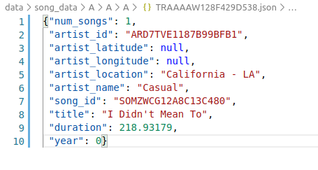
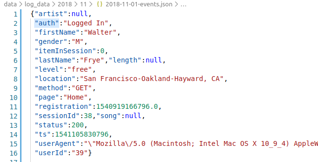
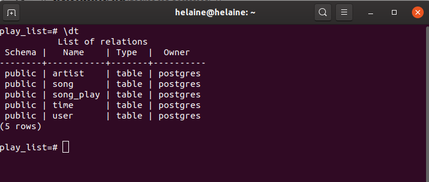

# Proyecto: Modelado de datos con PostgreSQL

# Introducción
La startup Sparkify quiera analizar los datos que ha estado recolectando sobre canciones y la actividad de los usuarios en su nueva app de transmisión de música. Los analistas estan interesados en entender que canciones están escuchando los usuarios. 
Actualmente no tienen una manera fácil de revisar sus datos ls cuales residen en un directorio con registros JSON que contienen la actividad de los usuarios, así como los metadatos de las canciones en su app.

El objetivo del proyecto consiste en crear una base de datos en PostgreSQL con tablas diseñadas para optimizar las consultas. Tablas de hechos y dimensiones en un esquema de estrella. Además se debe crear un ETL pipeline que transfiera los datos de los archivos a las tablas en PostgreSQL.


# Datos

**Canciones**

Cada archvido JSON del directorio `data\song_data` contiene los metadatos de las canciones, así como el artista que las interpretan.



**Log**

Es un conjunto de datos provenientes de [Million Song Dataset](http://millionsongdataset.com/) en formato JSON. Cada archivo contiene metadatos sobre artistas y sus canciones.




# Tablas

La base de datos estará compuesta de las siguientes tablas:

### **Tabla de hechos**
**SONGPLAY**
```
user_id, 
level, 
song_id, 
artist_id, 
session_id, 
start_time,
location, 
user_agent
```

### **Tabla de dimensiones**

**USERS**
```
user_id,
first_name,
last_name,
gender,
level
```

**SONG**
```
song_id,
artist_id,
title,
year,
duration
```
**ARTIST**
```
artist_id,
name,
location,
latitude,
longitude
```
**TIME**
```
start_time,
hour,
day,
week,
month,
year,
weekday
```
# Solución

* Paso 1. Instalar PostgreSQL (Docker)

  https://todopostgresql.com/docker-con-postgresql-2/
* Paso 2. Crear conexión en archivo `bd.py`
```
"postgres+psycopg2://<USERNAME>:<PASSWORD>@<IP_ADDRESS>:<PORT>/<DATABASE_NAME>"
```
* Paso 3. Correr el archivo `elt.py`

