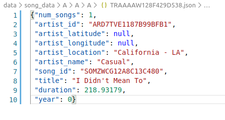
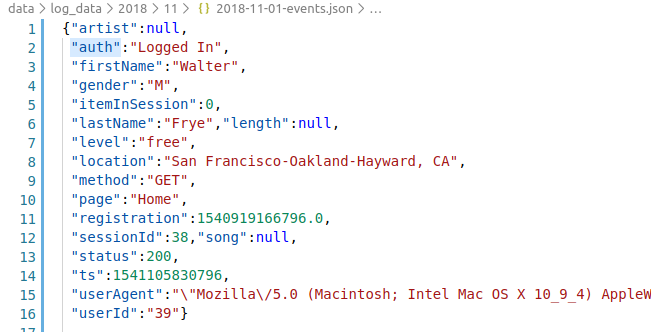
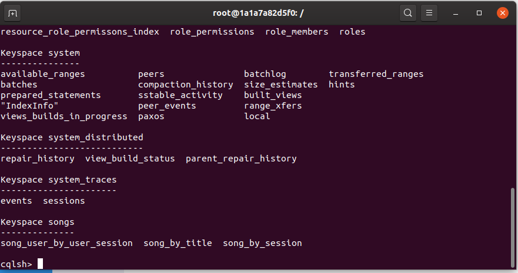

# Proyecto: Modelado de datos con Apache Cassandra

# Introducción
La startup Sparkify quiera analizar los datos que ha estado recolectando sobre canciones y la actividad de los usuarios en su nueva app de transmisión de música. Los analistas estan interesados en entender que canciones están escuchando los usuarios. 
Actualmente no tienen una manera fácil de revisar sus datos ls cuales residen en un directorio con registros JSON que contienen la actividad de los usuarios, así como los metadatos de las canciones en su app.

El objetivo del proyecto consiste en crear una base de datos NoSQL  que pueda crear consultas sobre los datos de reproducción de canciones que permitan responder las preguntas que necesiten. La base de datos a utilizar será Apache Cassandra para crear las tablas y ejecutar las consultas.

Preguntas:

1.- Encontrar los artistas, canciones y duración dentro del historial que se escucharon en una determinada sesión.

2.- Encontrar los artistas y canciones dentro del historial para un determinado usuario y sesión.

3. Encontrar los usuarios dentro del historial que escuchó una determinada canción.

# Datos

**Canciones**

Cada archvido JSON del directorio `data\song_data` contiene los metadatos de las canciones, así como el artista que las interpretan.

**Log**

Es un conjunto de datos provenientes de [Million Song Dataset](http://millionsongdataset.com/) en formato JSON. Cada archivo contiene metadatos sobre artistas y sus canciones.

# Solución

* Paso 1. Instalar Cassandra (Docker)

  https://medium.com/swlh/building-a-python-data-pipeline-to-apache-cassandra-on-a-docker-container-fc757fbfafdd

* Paso 2. Correr el archivo `elt.py`

