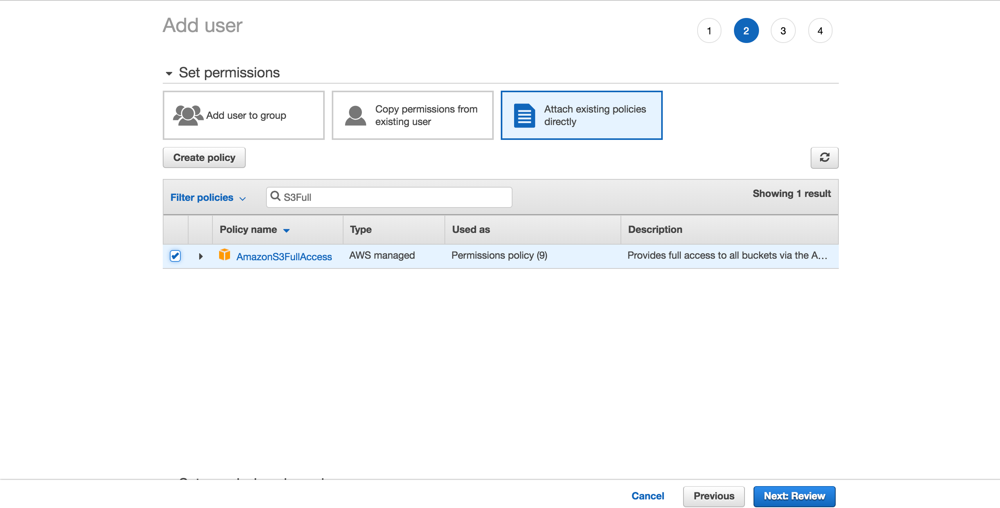
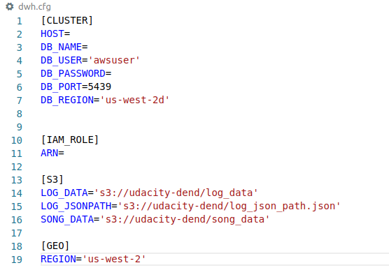

# Proyecto: Data Warehouse con RedShift

# Introducción
La startup de transmisión de música Sparkify, ha aumentado su base de datos de usuarios y de canciones y quiere mover sus procesos y datos a la nube. Sus datos reciden en AWS S3,en un directorios de Logs (JSON) y un directorio para las canciones (JSON). 

El objetivo del proyecto consiste en crear un ETL pipeline que extraiga los datos del AWS S3 y los transforme en un conjunto de tablas que serán enviados a ASW Redshift para que el equipo de análistas consulte la actividad de los usuarios.


# Datos

El dataset contiene dos datasets que estan almacenados en AWS S3. Links de cada uno:

 * Song data: 
  ```
  s3://udacity-dend/song_data
  ```
 * Long data:  
  ```
  s3://udacity-dend/log_data
  ```
**Canciones**

Metadatos de las canciones.


**Log**

Metadatos de los log


# Tablas

La base de datos estará compuesta de las siguientes tablas:

### **Tabla de hechos**
**SONGPLAY**
```
user_id, 
level, 
song_id, 
artist_id, 
session_id, 
start_time,
location, 
user_agent
```

### **Tabla de dimensiones**

**USERS**
```
user_id,
first_name,
last_name,
gender,
level
```

**SONG**
```
song_id,
artist_id,
title,
year,
duration
```
**ARTIST**
```
artist_id,
name,
location,
latitude,
longitude
```
**TIME**
```
start_time,
hour,
day,
week,
month,
year,
weekday
```
# Solución

* Paso 1. Crear un usuario IAM

  Para crear un nuevo usuario ir a tu cuenta *AWS* -> *Servicios* y seleccionar IAM.

  

* Paso 2. Crear archivos de configuración

  Crear el archivo credentials
  ```
  $ touch ~/.aws/credentials
  ```
  Abrir el archivo y pegar la siguiente estructura, llenado los campos con el archivo descargado.
  ```
    [default]
    aws_access_key_id = YOUR_ACCESS_KEY_ID
    aws_secret_access_key = YOUR_SECRET_ACCESS_KEY
  ```
* Paso 3. Llenar el archivo dhw.cfg con los datos del AWS Redshift creado

  

* Paso 4. Ejecutar el archivo `create_tables.py`

* Paso 5. Ejecutar el archivo  `etl.py`