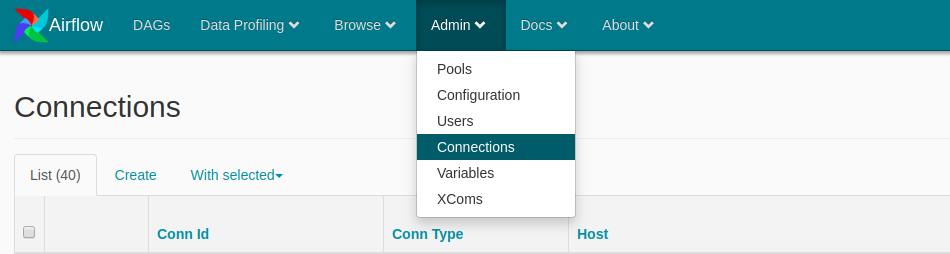
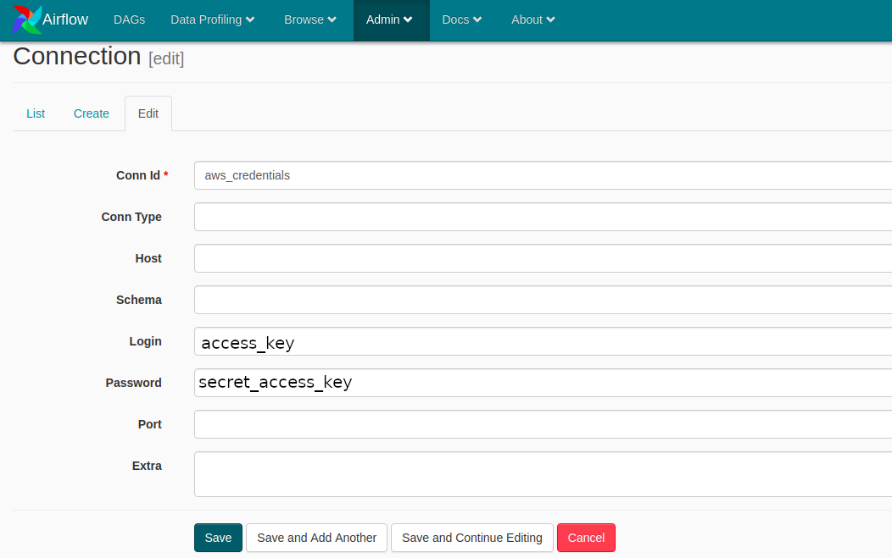
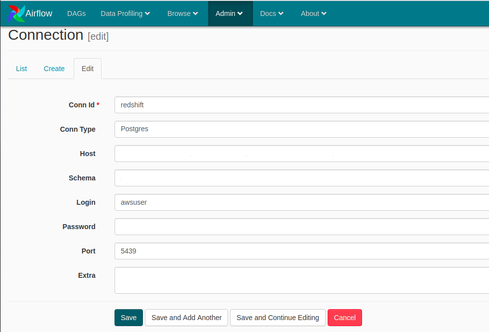
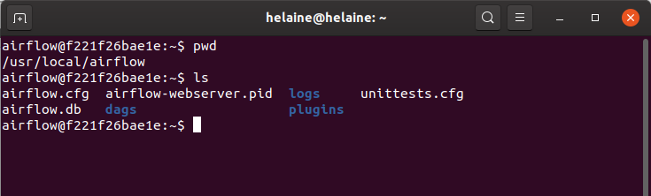

# Proyecto: Data Pipelines
Este proyecto consiste en usar Airflow para leer datos autómaticamentre en intervalos periódicos desde S3 y escribirlos en tablas de Amazon Redshift.

# Dataset
El dataset contiene dos datasets que estan almacenados en S3.
 * Song data: 
  ```
  s3://udacity-dend/song_data
  ```
 * Long data:  
  ```
  s3://udacity-dend/log_data
  ```

 ## Song dataset
 Es un conjunto de datos provenientes de [Million Song Dataset](http://millionsongdataset.com/) en formato JSON. Cada archivo contiene metadatos sobre artistas y sus canciones.


 ```
{
  "num_songs",
  "artist_id", 
  "artist_latitude",
  "artist_longitude",
  "artist_location",
  "artist_name",
  "song_id",
  "title",
  "duration",
  "year"
}
```
## Log dataset

Esté conjunto de datos contiene archivos log en formato JSON que simula registros de actividades de la aplicación Sparkify.

```
{
  "artist",
  "auth",
  "firstName",
  "gender",
  "itemInSession",
  "lastName",
  "length",
  "level",
  "location",
  "method",
  "page",
  "Registration",
  "SessionId",
  "song",
  "status",
  "ts",
  "userAgent",
  "userId"
}
```
# Tablas

### **Tabla de hechos**
**SONGPLAY**
```
user_id, 
level, 
song_id, 
artist_id, 
session_id, 
start_time,
location, 
user_agent
```

### **Tabla de dimensiones**

**USERS**
```
user_id,
first_name,
last_name,
gender,
level
```

**SONG**
```
song_id,
artist_id,
title,
year,
duration
```
**ARTIST**
```
artist_id,
name,
location,
latitude,
longitude
```
**TIME**
```
start_time,
hour,
day,
week,
month,
year,
weekday
```
# Solución

* Paso 1. Crear cluster en Redshift

* Paso 2. Crear tablas
  ```
  create_tables.sql
  ```
* Paso 3. Instalar Airflow (Docker)

  https://towardsdatascience.com/getting-started-with-airflow-using-docker-cd8b44dbff98

* Paso 4. Crear credenciales  en Airflow como conexiones

  Admin-> Connections -> Create

  

  Credenciales AWS

  

  Redshift

  

* Paso 5. Guardar archivos en Airflow

  Ruta en Airflow

  

  

